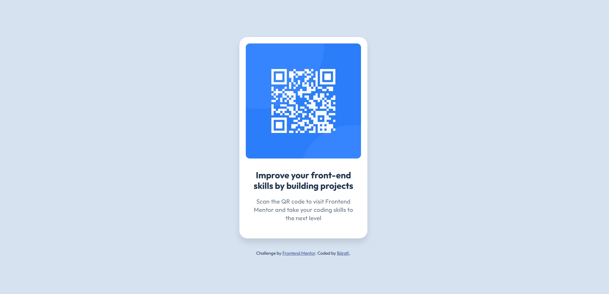

# Frontend Mentor - QR code component solution

This is a solution to the [QR code component challenge on Frontend Mentor](https://www.frontendmentor.io/challenges/qr-code-component-iux_sIO_H). Frontend Mentor challenges help you improve your coding skills by building realistic projects. 


## Overview

### Screenshot



### Links

- Solution URL: [Add solution URL here](https://github.com/BaraKalvo/FM_qr_code)
- Live Site URL: [Add live site URL here](https://barakalvo.github.io/FM_qr_code/)

## My process

### Built with

- Semantic HTML5 markup
- CSS3


### What I learned

Vertical and horizontal centering technique

```css
body {
  margin: 0;
  height: 100vh;
  display: flex;
  flex-direction: column;
  justify-content: center;
  align-items: center;
}
```

## Author

- Frontend Mentor - [@BaraKalvo](https://www.frontendmentor.io/profile/BaraKalvo)
